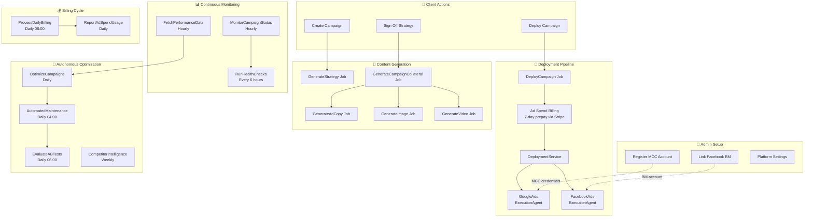
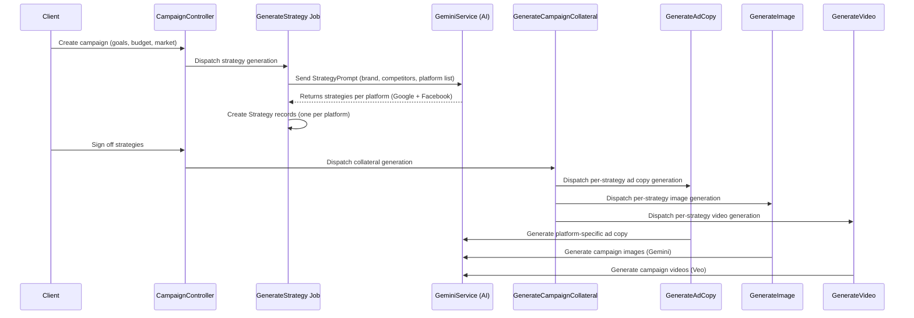
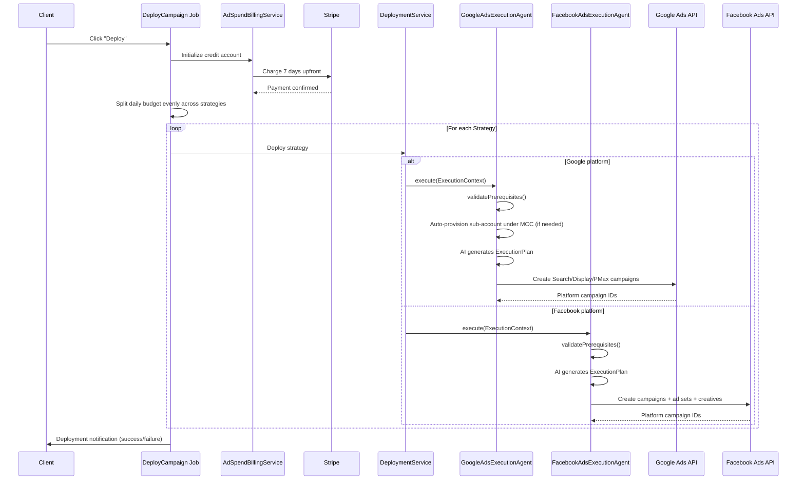
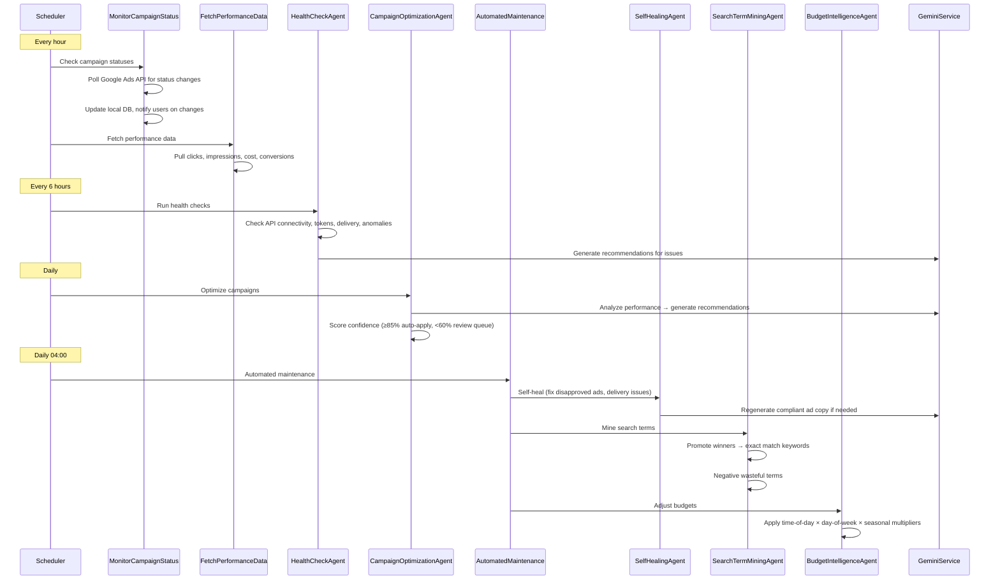
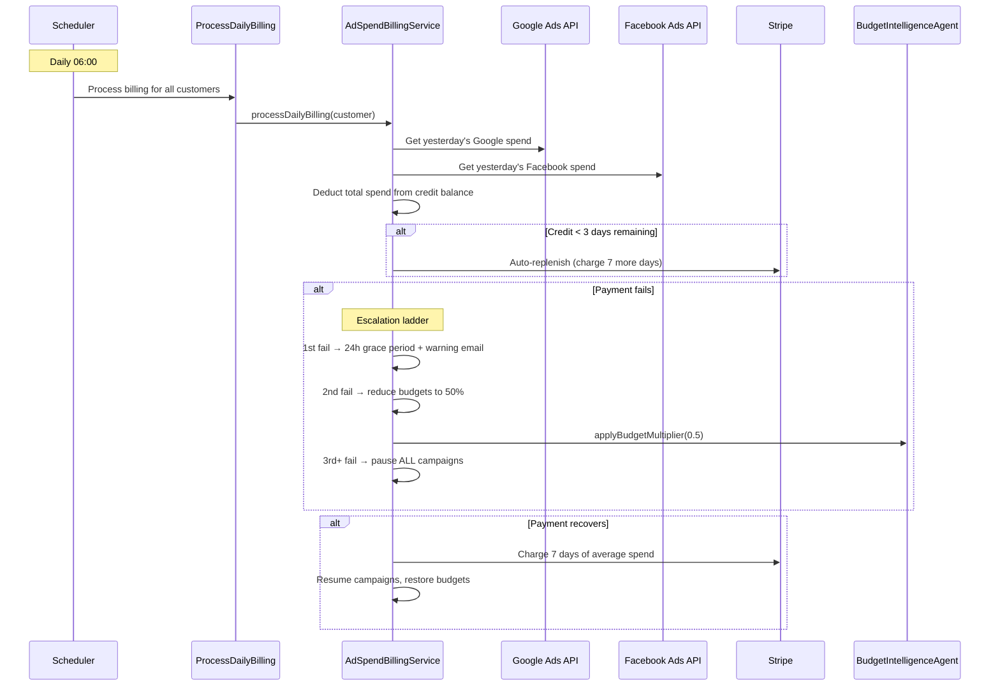
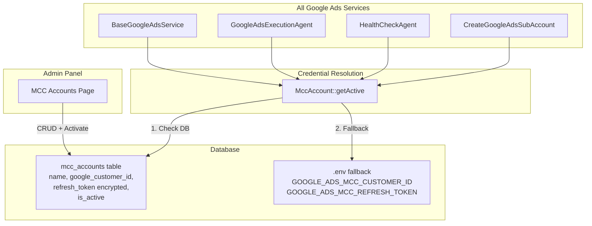
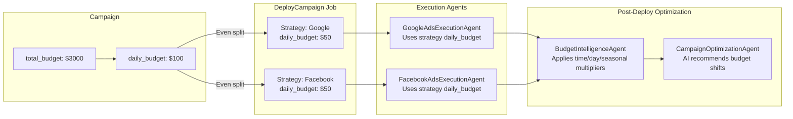
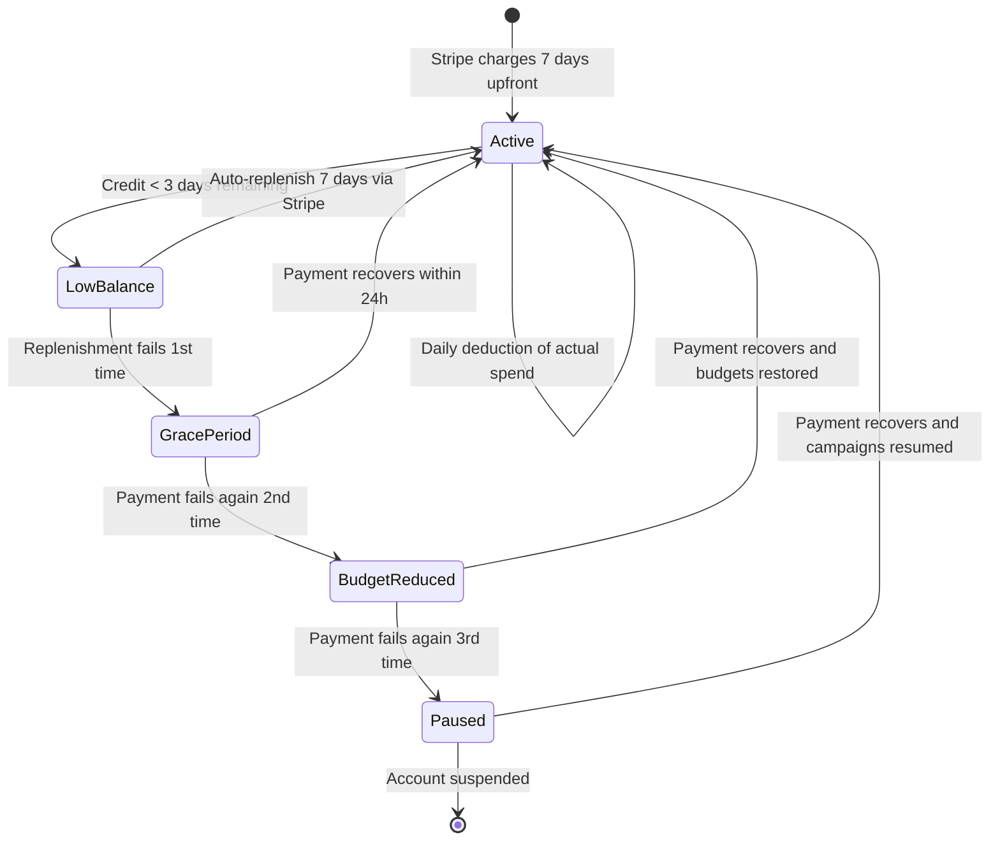

# Spectra Media Agent — System Architecture

> A complete guide to the autonomous advertising platform: every agent, job, and service, and how they fit together.

## High-Level Overview

Spectra is an AI-powered advertising agency platform. Clients create campaigns, and the system autonomously deploys ads across Google and Facebook, monitors performance, optimises spend, heals broken ads, mines keywords, runs A/B tests, and handles billing — all without human intervention after initial setup.

---

## The Complete Workflow

### Phase 1: Campaign Creation & Content Generation

### Phase 2: Deployment & Billing

### Phase 3: Continuous Monitoring & Optimization

### Phase 4: Billing Cycle

---

## Agent Inventory

### Deployment Agents

| Agent | Trigger | Purpose |
|-------|---------|---------|
| **GoogleAdsExecutionAgent** | `DeployCampaign` job | AI-powered Google Ads deployment — creates Search, Display, PMax, and Video campaigns. Auto-provisions sub-accounts under MCC. |
| **FacebookAdsExecutionAgent** | `DeployCampaign` job | AI-powered Facebook/Meta deployment — handles Dynamic Creative, Advantage+, carousel/video ads. |

### Optimization Agents

| Agent | Trigger | Purpose |
|-------|---------|---------|
| **CampaignOptimizationAgent** | Daily `OptimizeCampaigns` job | AI cross-platform optimization. Generates scored recommendations — auto-applies at ≥85% confidence, queues for review at <60%. |
| **BudgetIntelligenceAgent** | Daily 04:00 `AutomatedMaintenance` job | Rule-based budget adjustments using time-of-day, day-of-week, and seasonal multipliers from config. Also called by billing on payment failure. |
| **SearchTermMiningAgent** | Daily 04:00 `AutomatedMaintenance` job | Mines Google search term reports. Promotes high-CTR terms to exact match keywords, negates wasteful terms. |
| **SelfHealingAgent** | Daily 04:00 `AutomatedMaintenance` job | Detects and fixes ad issues: disapproved ads (AI-regenerates copy), budget problems, delivery issues. Retry with exponential backoff. |
| **ABTestingAgent** | Daily 06:00 `EvaluateABTests` job | Manages A/B tests on creative assets. Chi-squared significance testing at 95% confidence, auto-applies winners. |
| **CreativeIntelligenceAgent** | Manual | Analyses creative performance at asset level (headlines, descriptions, images). Identifies winners/losers and generates AI variations. |

### Intelligence Agents

| Agent | Trigger | Purpose |
|-------|---------|---------|
| **CompetitorIntelligenceAgent** | Weekly `RunCompetitorIntelligence` job | Orchestrator — coordinates discovery, analysis, auction insights, and counter-strategy generation. |
| **CompetitorDiscoveryAgent** | Called by CompetitorIntelligenceAgent | Uses Google Search API + Gemini to discover competitors based on customer's website and industry. |
| **CompetitorAnalysisAgent** | Called by CompetitorIntelligenceAgent | Scrapes competitor websites, extracts messaging/positioning/pricing via AI. |
| **AudienceIntelligenceAgent** | Manual | Manages Customer Match lists, audience segmentation, and lookalike audience recommendations. |

### Monitoring Agents

| Agent | Trigger | Purpose |
|-------|---------|---------|
| **HealthCheckAgent** | Every 6 hours `RunHealthChecks` job | Comprehensive health monitoring: API connectivity, token validity, campaign delivery, performance anomalies, budget pacing, creative fatigue, billing status. |
| **AccountAuditAgent** | Manual `RunAccountAudit` job | Full account audit scoring 0–100 with findings by severity and AI recommendations. |

---

## Scheduled Jobs Timeline

```mermaid
gantt
    title Daily Automation Schedule
    dateFormat HH:mm
    axisFormat %H:%M

    section Hourly
    MonitorCampaignStatus           :active, 00:00, 1h
    FetchPerformanceData            :active, 00:00, 1h

    section Every 6 Hours
    RunHealthChecks                 :crit, 00:00, 30min
    RunHealthChecks                 :crit, 06:00, 30min
    RunHealthChecks                 :crit, 12:00, 30min
    RunHealthChecks                 :crit, 18:00, 30min

    section Daily
    OptimizeCampaigns               :done, 00:00, 2h
    CheckCampaignPolicyViolations   :done, 00:00, 1h

    section Daily 04:00
    SelfHealingAgent                :04:00, 30min
    SearchTermMiningAgent           :04:30, 30min
    BudgetIntelligenceAgent         :05:00, 30min

    section Daily 06:00
    ProcessDailyAdSpendBilling      :06:00, 1h
    EvaluateABTests                 :06:00, 30min
    ReportAdSpendUsage              :06:00, 15min
```

---

## MCC Account Management

All Google Ads operations run through a platform-owned MCC (Manager) account. Admins manage MCC accounts via **Admin > MCC Accounts**.

---

## Budget Flow

---

## Ad Spend Billing Lifecycle

---

## Key Configuration

### `config/budget_rules.php`

Controls the rule-based automation thresholds used by `BudgetIntelligenceAgent`, `SearchTermMiningAgent`, and `SelfHealingAgent`:

| Section | Examples |
|---------|----------|
| Time-of-day multipliers | 0.5× overnight, 1.0× business hours, 1.3× evening prime |
| Day-of-week multipliers | 0.8× Sunday, 1.0× midweek, 1.3× Friday |
| Seasonal multipliers | 2.0× Black Friday, 1.8× Cyber Monday |
| Self-healing rules | Max 3 fix attempts, 24h retry delay, min 0.5% CTR |
| Search term mining | Min 100 impressions, promote at 5% CTR, negative at $20 cost + 0 conversions |
| Budget reallocation | Min ROAS 1.5, max 20% shift per cycle, min 7 days data |

### `config/seasonal_strategies.php`

Presets for seasonal campaign adjustments used by `ApplySeasonalStrategyShift`:

| Season | Budget Multiplier | Bidding Strategy | Copy Theme |
|--------|-------------------|------------------|------------|
| Black Friday | 1.5× | TARGET_CPA | Urgency |
| Summer Sale | 1.2× | MAXIMIZE_CONVERSIONS | Summer |
| Default | 1.0× | MAXIMIZE_CONVERSIONS | Evergreen |
