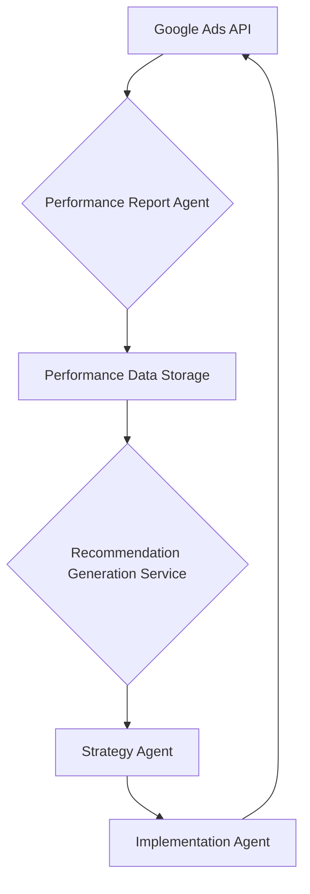

# Spectra: Google Ads Performance Optimization Plan

## 1. Introduction

This document outlines the design and implementation plan for a new system within Spectra focused on automated Google Ads performance reporting, analysis, and recommendation generation. The goal is to create an intelligent feedback loop where campaign performance data is collected, analyzed, and used to provide actionable recommendations, which are then integrated into the existing agent-based campaign management workflow.

## 2. High-Level Overview

The system will consist of a new "Performance Report Agent" responsible for fetching Google Ads performance data. This data will be fed into a "Recommendation Generation Service" that will analyze the data against current campaign parameters to identify optimization opportunities. The generated recommendations will then be passed to the existing "Strategy Agent" for evaluation and prioritization, which in turn will instruct the "Implementation Agent" to apply the necessary changes using the existing Google Ads services.



## 3. Core Components and Responsibilities

### 3.1. Performance Report Agent

**Purpose:** To retrieve comprehensive performance metrics and campaign data from the Google Ads API.

**Responsibilities:**

*   **Data Collection:** Fetch metrics (e.g., impressions, clicks, conversions, cost, CTR, CPC, CPA) and dimensions (e.g., campaign, ad group, ad, keyword, geographic, device) for various campaign types (Search, Display, Video).
*   **API Interaction:** Utilize `GoogleAdsService::searchStream` for efficient retrieval of large datasets.
*   **Data Storage:** Store raw or lightly processed performance data in a structured format (e.g., database table or data lake) for historical analysis and input to the Recommendation Generation Service.
*   **Scheduling:** Implement mechanisms for regular, scheduled data fetches (e.g., daily, hourly).

**Key API Interactions:**

*   `GoogleAdsService::searchStream`: For querying campaign, ad group, ad, keyword, and other performance reports.

**Example Data Points to Collect:**

*   `campaign.name`, `campaign.id`
*   `ad_group.name`, `ad_group.id`
*   `ad.id`, `ad.type`
*   `metrics.impressions`, `metrics.clicks`, `metrics.conversions`, `metrics.cost_micros`
*   `segments.date`, `segments.device`, `segments.ad_network_type`

### 3.2. Recommendation Generation Service

**Purpose:** To analyze performance data and generate actionable recommendations for campaign optimization.

**Responsibilities:**

*   **Data Analysis:** Process historical and recent performance data to identify trends, anomalies, and areas for improvement.
*   **Recommendation Logic:** Employ business rules, statistical analysis, and potentially machine learning models (e.g., LLMs) to formulate specific recommendations.
*   **Recommendation Types:** Generate recommendations such as:
    *   **Budget Adjustments:** Increase/decrease daily budget based on performance and remaining budget.
    *   **Bidding Strategy Changes:** Suggest switching bidding strategies (e.g., from Manual CPC to Target CPA).
    *   **Ad Copy Optimization:** Recommend A/B tests for headlines/descriptions based on CTR.
    *   **Targeting Refinements:** Suggest adjusting geographic, demographic, or audience targeting.
    *   **Negative Keyword/Placement Suggestions:** Identify underperforming keywords or placements.
*   **Structured Output:** Produce recommendations in a standardized, machine-readable format (e.g., JSON) including the recommended action, target entity (campaign, ad group), parameters for change, and rationale.

**Input:** Performance data from the Performance Report Agent, current campaign configuration.

**Output (Conceptual JSON):**

```json
[
    {
        "type": "BUDGET_INCREASE",
        "target_campaign_id": "12345",
        "new_budget_amount": 100.00,
        "rationale": "Campaign is consistently hitting daily budget cap and performing well."
    },
    {
        "type": "AD_COPY_OPTIMIZATION",
        "target_ad_group_id": "67890",
        "recommendation": "Test new headline 'Achieve More Today' due to low CTR on existing headlines."
    }
]
```

### 3.3. Strategy Agent Integration

**Purpose:** To receive, evaluate, and prioritize recommendations, and translate them into a high-level strategy for the Implementation Agent.

**Responsibilities:**

*   **Recommendation Ingestion:** Receive structured recommendations from the Recommendation Generation Service.
*   **Evaluation & Prioritization:** Assess recommendations based on overall campaign goals, current strategy, and potential impact.
*   **Decision Making:** Decide which recommendations to act upon and in what order.
*   **Instruction Generation:** Formulate high-level instructions for the Implementation Agent, detailing the desired changes.

### 3.4. Implementation Agent Integration

**Purpose:** To execute the strategic instructions received from the Strategy Agent using the appropriate Google Ads services.

**Responsibilities:**

*   **Instruction Interpretation:** Understand the commands from the Strategy Agent (e.g., "increase budget for campaign X", "update ad copy for ad group Y").
*   **Service Invocation:** Call the relevant existing Google Ads services (e.g., `UpdateCampaignBudget`, `MutateAdGroupAds`, `CreateDisplayCampaign`, `CreateVideoCampaign` etc.) to apply the changes.
*   **Error Handling & Reporting:** Report success or failure of implementation back to the Strategy Agent or a logging system.

## 4. Technical Considerations

*   **Data Storage:** A dedicated database (e.g., PostgreSQL with pgvector for embeddings if needed for recommendation logic) for storing performance reports, historical campaign data, and generated recommendations.
*   **API Quotas:** Implement robust retry mechanisms and monitor API quotas to prevent service interruptions.
*   **Error Handling:** Centralized logging and alerting for API errors, data processing failures, and recommendation generation issues.
*   **Scalability:** Design for handling a growing number of customer accounts and campaigns.
*   **Security:** Ensure secure handling of Google Ads API credentials and customer data.
*   **Version Control:** Manage different versions of recommendation models or business rules.

## 5. Phased Approach

### Phase 1: Performance Report Agent MVP

*   Implement core functionality to fetch daily performance reports for a single campaign type (e.g., Display) and store them.
*   Establish basic scheduling.

### Phase 2: Basic Recommendation Generation

*   Develop initial recommendation logic (e.g., simple budget adjustments based on spend/performance).
*   Integrate with the Strategy Agent to pass these basic recommendations.

### Phase 3: Strategy & Implementation Integration

*   Enhance Strategy Agent to receive and process recommendations.
*   Enable Implementation Agent to act on simple instructions.

### Phase 4: Advanced Recommendations & Campaign Types

*   Expand recommendation logic (LLM integration, A/B testing suggestions).
*   Extend reporting and recommendation to other campaign types (Video, Search).
*   Refine feedback loop.

