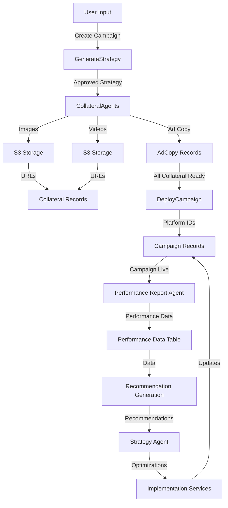

# Spectra Media Agent - System Architecture & Agent Reference

This document provides a comprehensive overview of all agents within the Spectra Media Agent system, their specific functions, and how they interact with each other to create an autonomous marketing platform.

## System Overview

Spectra is an agentic digital marketing platform that automates the creation, deployment, and optimization of marketing campaigns across Google Ads and Facebook Ads. The system follows a workflow-driven architecture where different agents (implemented as Laravel Jobs and Services) handle specific responsibilities and communicate through a queued job system.

```
User Input → Strategy Agent → Deployment Agents → Performance Analysis → Optimization Loop
```

---

## Core Agents

### 1. Strategy Agent

**Purpose:** Generate and refine marketing strategies based on business inputs and performance data.

**Implementation:**
- **Job:** `GenerateStrategy` (`app/Jobs/GenerateStrategy.php`)
- **Service:** `StrategyGenerator`
- **LLM Integration:** Uses Google Gemini API via `GeminiService`

**Responsibilities:**
- Analyzes business details from the knowledge base
- Generates platform-specific marketing strategies (Google Ads, Facebook Ads, Microsoft Ads)
- Creates structured output including bidding strategies with concrete parameters
- Receives performance recommendations and refines strategies accordingly
- Stores strategies with approval status (pending_approval → approved)

**Key Features:**
- Generates platform-specific ad copy strategies
- Defines imagery/video strategy recommendations
- Selects appropriate bidding strategies (TargetCPA, MaximizeConversions, etc.)
- Incorporates seasonal strategy shifts
- Learns from past performance data

**Input Data:**
- Knowledge base content
- Business information
- Historical performance data
- Seasonal adjustments

**Output Data:**
- Strategy records with:
  - Platform name
  - Ad copy strategy
  - Imagery strategy
  - Video strategy
  - Bidding strategy (with parameters)
  - Revenue CPA multiple

---

### 2. Performance Report Agent

**Purpose:** Collect and aggregate performance data from advertising platforms.

**Implementation:**
- **Jobs:**
  - `FetchGoogleAdsPerformanceData` - Fetches from Google Ads API
  - `FetchFacebookAdsPerformanceData` - Fetches from Facebook Graph API
- **Command:** `CampaignFetchPerformanceData` (dispatches both)
- **Services:**
  - `GoogleAdsService` - Google Ads API wrapper
  - `FacebookAds/InsightService` - Facebook insights fetcher

**Responsibilities:**
- Queries advertising platforms for campaign metrics
- Normalizes data (handles currency conversions, date formats, etc.)
- Stores performance data in database
- Triggers recommendation generation
- Handles API failures gracefully with retry logic

**Key Features:**
- Fetches last 3 days of performance data (configurable)
- Implements circuit breaker pattern for resilience
- Uses distributed locks to prevent concurrent runs
- Includes exponential backoff retry logic (5 tries max)
- Extracts conversions from platform-specific action data

**Google Ads Metrics Collected:**
- Impressions, clicks, cost, conversions
- Segments by date, device, ad network type

**Facebook Ads Metrics Collected:**
- Impressions, clicks, cost, conversions
- Reach, frequency
- CPC, CPM, CPA

**Output Data:**
- `GoogleAdsPerformanceData` records
- `FacebookAdsPerformanceData` records

**Scheduling:**
```php
// Run every 2 hours
$schedule->command('campaign:fetch-performance-data')->everyTwoHours();
```

---

### 3. Recommendation Generation Service

**Purpose:** Analyze performance data and generate actionable optimization recommendations.

**Implementation:**
- **Service:** `RecommendationGenerationService` (`app/Services/GoogleAds/RecommendationGenerationService.php`)
- **LLM Integration:** Uses Google Gemini with `GoogleAdsRecommendationPrompt`
- **Triggered by:** Performance Report Agents

**Responsibilities:**
- Analyzes performance trends and anomalies
- Compares actual performance against campaign goals
- Generates platform-specific recommendations
- Creates structured recommendation objects
- Stores recommendations for strategy agent review

**Recommendation Types:**
- Budget adjustments (increase/decrease)
- Bidding strategy changes
- Ad copy optimization (A/B testing)
- Targeting refinements (geographic, demographic, audience)
- Negative keyword suggestions
- Placement optimizations

**Key Features:**
- Rule-based initial analysis
- LLM-powered intelligent recommendations
- Calculates ROAS and other KPIs
- Identifies underperforming campaigns/ad groups
- Provides rationale for each recommendation

**Output Data:**
- `Recommendation` records with:
  - Type (budget, bidding, copy, targeting, etc.)
  - Target entity (campaign, ad group, keyword)
  - Parameters (specific values/changes)
  - Rationale (explanation)
  - Status (pending, approved, rejected, executed)
  - Platform (google, facebook)

---

### 4. Collateral Generation Agents

**Purpose:** Create marketing assets (images, videos, ad copy) based on approved strategies.

#### 4.1 Ad Copy Agent

**Implementation:**
- **Job:** `GenerateAdCopy` (`app/Jobs/GenerateAdCopy.php`)
- **Service:** `AdminMonitorService` (validates generated copy)
- **LLM Integration:** Uses `GeminiService` with `AdCopyPrompt`

**Responsibilities:**
- Generates platform-specific ad headlines and descriptions
- Validates copy against platform requirements (character limits, punctuation rules)
- Performs programmatic validation (headline count, description length)
- Uses AI to review quality and relevance
- Regenerates if validation fails (max 3 attempts)

**Platform-Specific Rules:**
- **Google Ads Search:** 3 headlines (max 30 chars), 2 descriptions (max 90 chars)
- **Facebook Ads:** Flexible format with multiple headlines and descriptions
- **Display Ads:** Shorter headlines, varied description lengths

**Validation Process:**
1. Programmatic validation (character limits, format)
2. AI qualitative review (relevance, engagement potential)
3. Overall status determination (approved/needs_revision)
4. Automatic regeneration if needed

**Output Data:**
- `AdCopy` records with:
  - Strategy reference
  - Platform
  - Headlines (JSON array)
  - Descriptions (JSON array)
  - Status (approved/needs_revision)

---

#### 4.2 Image Generation Agent

**Implementation:**
- **Job:** `GenerateImage` (`app/Jobs/GenerateImage.php`)
- **Service:** `GeminiService` (calls image generation API)
- **External API:** Google Gemini Image Generation or Nano Banana

**Responsibilities:**
- Generates images based on strategy imagery guidelines
- Uploads images to AWS S3
- Stores CloudFront URLs
- Handles image optimization and resizing

**Features:**
- Prompt-based image generation
- Automatic S3 upload
- CloudFront URL generation for distribution
- Error handling with retry

**Output Data:**
- `Collateral` records with image URLs

---

#### 4.3 Image Refinement Agent

**Implementation:**
- **Job:** `RefineImage` (`app/Jobs/RefineImage.php`)
- **Purpose:** Improve or adjust generated images based on feedback

**Responsibilities:**
- Takes feedback from performance or user review
- Modifies image prompts for regeneration
- Uploads refined versions

---

#### 4.4 Video Generation Agent

**Implementation:**
- **Job:** `GenerateVideo` (`app/Jobs/GenerateVideo.php`)
- **Service:** Integration with video generation API (VEO or similar)

**Responsibilities:**
- Generates videos based on strategy video guidelines
- Uploads to S3
- Provides CloudFront URLs
- Monitors video processing status

**Related Job:**
- **`CheckVideoStatus`** - Monitors async video generation completion

**Output Data:**
- `Collateral` records with video URLs

---

### 5. Deployment Agent

**Purpose:** Publish approved campaigns to advertising platforms.

**Implementation:**
- **Job:** `DeployCampaign` (`app/Jobs/DeployCampaign.php`)
- **Service:** `DeploymentService` (factory for platform-specific strategies)
- **Platform Strategies:**
  - `GoogleAdsDeploymentStrategy` - Uses Google Ads services
  - `FacebookAdsDeploymentStrategy` - Uses Facebook Ads services

**Responsibilities:**
- Creates campaigns on advertising platforms
- Publishes ad groups, ad sets, ads
- Associates generated collateral (images, videos, copy)
- Sets budgets and bidding strategies
- Handles platform-specific requirements
- Logs deployment results

**Workflow:**
1. Validates all collateral is generated and approved
2. Creates campaign structure on platform
3. Uploads creative assets
4. Sets targeting and bidding
5. Activates campaign
6. Stores platform IDs for tracking

**Platform Integration:**
- **Google Ads:** Uses Google Ads client library
- **Facebook Ads:** Uses FacebookAdsService for API calls

**Output Data:**
- Updates `Campaign` with platform IDs
- Creates campaign records with external references

---

### 6. Knowledge Base Agents

**Purpose:** Extract and structure business information for strategy generation.

#### 6.1 Sitemap Crawler Agent

**Implementation:**
- **Job:** `CrawlSitemap` (`app/Jobs/CrawlSitemap.php`)

**Responsibilities:**
- Crawls website sitemaps
- Extracts URLs and page metadata
- Stores page information for analysis

---

#### 6.2 Page Crawl Agent

**Implementation:**
- **Job:** `CrawlPage` (`app/Jobs/CrawlPage.php`)

**Responsibilities:**
- Crawls individual pages
- Extracts content, headings, metadata
- Builds knowledge base for strategy generation

---

#### 6.3 Competitor Website Crawler

**Implementation:**
- **Job:** `CrawlCompetitorWebsite` (`app/Jobs/CrawlCompetitorWebsite.php`)

**Responsibilities:**
- Analyzes competitor websites
- Extracts competitive intelligence
- Informs strategy generation

---

#### 6.4 File Processing Agent

**Implementation:**
- **Job:** `ProcessKnowledgeBaseFile` (`app/Jobs/ProcessKnowledgeBaseFile.php`)

**Responsibilities:**
- Processes uploaded files (PDFs, docs)
- Extracts text and metadata
- Integrates into knowledge base

---

### 7. Analysis & Optimization Agents

#### 7.1 Keyword Quality Score Agent

**Implementation:**
- **Job:** `GetKeywordQualityScore` (`app/Jobs/GetKeywordQualityScore.php`)
- **Service:** Google Ads API integration

**Responsibilities:**
- Fetches quality scores from Google Ads
- Identifies low-quality keywords
- Suggests keyword improvements

---

#### 7.2 Underperforming Keywords Agent

**Implementation:**
- **Job:** `FindUnderperformingKeywords` (`app/Jobs/FindUnderperformingKeywords.php`)

**Responsibilities:**
- Analyzes keyword performance metrics
- Identifies low CTR, high CPC keywords
- Recommends keyword adjustments

---

#### 7.3 Policy Violation Checker

**Implementation:**
- **Job:** `CheckCampaignPolicyViolations` (`app/Jobs/CheckCampaignPolicyViolations.php`)

**Responsibilities:**
- Checks ads against platform policies
- Identifies policy violations
- Recommends corrections

---

#### 7.4 Seasonal Strategy Shift Agent

**Implementation:**
- **Job:** `ApplySeasonalStrategyShift` (`app/Jobs/ApplySeasonalStrategyShift.php`)

**Responsibilities:**
- Detects seasonal trends
- Applies seasonal adjustments to strategy
- Adjusts budgets for peak seasons

---

## Agent Interaction Flow

### Campaign Creation & Deployment Flow

```
1. User Creates Campaign
   ↓
2. GenerateStrategy Job
   ├─ Reads knowledge base
   ├─ Calls Gemini API
   └─ Stores Strategy (pending_approval)
   ↓
3. User Reviews & Approves Strategy
   ↓
4. Collateral Generation (Parallel Jobs)
   ├─ GenerateAdCopy → AdminMonitorService → AdCopy records
   ├─ GenerateImage → GeminiService → S3 → Collateral records
   └─ GenerateVideo → VEO API → S3 → Collateral records
   ↓
5. DeployCampaign Job
   ├─ Gets all approved collateral
   ├─ Creates campaign on platform (Google/Facebook)
   ├─ Uploads creatives
   ├─ Sets targeting & bidding
   └─ Stores platform IDs
   ↓
6. Campaign Live on Platform
```

### Performance Analysis & Optimization Flow

```
1. CampaignFetchPerformanceData Command (scheduled every 2 hours)
   ├─ Dispatches FetchGoogleAdsPerformanceData for each Google campaign
   └─ Dispatches FetchFacebookAdsPerformanceData for each Facebook campaign
   ↓
2. Performance Data Agents (Parallel)
   ├─ Query platform APIs
   ├─ Normalize data
   └─ Store in PerformanceData tables
   ↓
3. RecommendationGenerationService (Triggered after data stored)
   ├─ Analyzes trends
   ├─ Calculates KPIs
   ├─ Calls Gemini for intelligent recommendations
   └─ Stores Recommendation records
   ↓
4. Strategy Agent Reviews Recommendations
   ├─ Evaluates against current strategy
   ├─ Prioritizes recommendations
   └─ Decides which to apply
   ↓
5. Implementation (if recommendation approved)
   ├─ Calls appropriate Google/Facebook service
   ├─ Updates campaign parameters
   └─ Logs changes
   ↓
6. Next performance fetch (2 hours later)
   └─ Cycle repeats with new data
```

## Data Flow Between Agents



## Service Layer (Supporting Agents)

### Google Ads Services
- `BaseGoogleAdsService` - Base HTTP client for Google Ads API
- `CreateCampaign` - Creates campaigns
- `CreateManagedAccount` - Creates managed accounts under MCC
- `CreateVideoCampaign` - Creates video campaigns
- `CreateDisplayCampaign` - Creates display campaigns
- And others for ad groups, ads, keywords, etc.

### Facebook Ads Services
- `BaseFacebookAdsService` - Base HTTP client for Graph API
- `AdAccountService` - Account management
- `CampaignService` - Campaign management
- `AdSetService` - Ad set management
- `AdService` - Individual ad management
- `CreativeService` - Creative asset management
- `InsightService` - Performance metrics & insights

### Support Services
- `GeminiService` - LLM API integration
- `AdminMonitorService` - Ad copy validation
- `DeploymentService` - Platform-specific deployment
- `RecommendationGenerationService` - Recommendation logic
- `BudgetAllocationService` - Budget distribution

## Execution Model

### Job Queue System
All agents are implemented as Laravel Jobs, running through the queue system:

```bash
php artisan queue:work
```

This allows:
- Asynchronous execution
- Parallel processing (multiple workers)
- Retry logic with exponential backoff
- Failed job tracking

### Scheduling
Some agents run on a schedule via Laravel's Task Scheduler:

```bash
php artisan schedule:run
```

Scheduled tasks:
- `CampaignFetchPerformanceData` - Every 2 hours
- Custom seasonal checks
- Periodic health checks

## Error Handling & Resilience

### Circuit Breaker Pattern
Prevents cascading failures:
```php
$circuitBreaker = new CircuitBreakerService('GoogleAdsAPI');
if ($circuitBreaker->isAvailable()) {
    // Execute API call
    $circuitBreaker->recordSuccess();
} else {
    // Circuit open, skip execution
}
```

### Lock Mechanism
Prevents concurrent execution:
```php
$lock = Cache::lock('fetch-performance-data-'.$campaignId, 600);
if ($lock->get()) {
    // Execute
    $lock->release();
}
```

### Retry Logic
Automatic retry with backoff:
```php
public $tries = 5;
public $backoff = [10, 20, 30, 40, 50];
```

## Configuration

### Environment Variables Required
```env
# Gemini API
GEMINI_API_KEY=...

# Google Ads
GOOGLE_ADS_DEVELOPER_TOKEN=...
GOOGLE_ADS_CUSTOMER_ID=...
GOOGLE_ADS_MCC_CUSTOMER_ID=...
GOOGLE_ADS_REFRESH_TOKEN=...

# Facebook Ads
FACEBOOK_APP_ID=...
FACEBOOK_APP_SECRET=...
FACEBOOK_OAUTH_CALLBACK_URL=...

# AWS (for image/video storage)
AWS_ACCESS_KEY_ID=...
AWS_SECRET_ACCESS_KEY=...
AWS_DEFAULT_REGION=...
AWS_BUCKET=...
```

## Monitoring & Logging

All agents include comprehensive logging:
```
Log::info("Agent starting", ['context' => 'data']);
Log::warning("Potential issue", ['context' => 'data']);
Log::error("Failed operation", ['exception' => $e]);
```

Logs include:
- Agent start/completion
- API calls and responses
- Data counts and metrics
- Error messages with context
- Performance metrics (time taken, records processed)

## Next Steps for Enhancement

1. **Multi-Agent Collaboration** - Enable agents to share learnings
2. **Real-time Optimization** - Move from 2-hour cycles to real-time
3. **Advanced ML** - Implement predictive models for recommendations
4. **A/B Testing Orchestration** - Automated test creation and analysis
5. **Cross-Platform Optimization** - Coordinate strategies across Google & Facebook
6. **Competitive Intelligence** - Continuous competitor monitoring
7. **Budget Forecasting** - Predict optimal budget allocation
8. **Custom Model Integration** - Support for client-specific optimization rules

---

## Summary

The Spectra Media Agent system is built on a modular agent architecture where:

- **Strategy Agent** creates plans
- **Collateral Agents** create assets
- **Deployment Agent** publishes campaigns
- **Performance Agents** collect data
- **Recommendation Service** analyzes for improvements
- **Analysis Agents** provide specialized insights

All agents work together through an asynchronous queue system, creating a truly autonomous marketing optimization loop that continuously improves campaign performance without human intervention.
