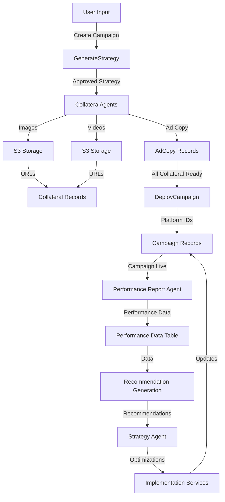

# Spectra Media Agent - System Architecture & Agent Reference

This document provides a comprehensive overview of all agents within the Spectra Media Agent system, their specific functions, and how they interact with each other to create an autonomous marketing platform.

## System Overview

Spectra is an agentic digital marketing platform that automates the creation, deployment, and optimization of marketing campaigns across Google Ads and Facebook Ads. The system follows a workflow-driven architecture where different agents (implemented as Laravel Jobs and Services) handle specific responsibilities and communicate through a queued job system.

```
User Input → Strategy Agent → Deployment Agents → Performance Analysis → Optimization Loop
```

---

## Core Agents

### 1. Strategy Agent

**Purpose:** Generate and refine marketing strategies based on business inputs and performance data.

**Implementation:**
- **Job:** `GenerateStrategy` (`app/Jobs/GenerateStrategy.php`)
- **Service:** `StrategyGenerator`
- **LLM Integration:** Uses Google Gemini API via `GeminiService`

**Responsibilities:**
- Analyzes business details from the knowledge base
- Generates platform-specific marketing strategies (Google Ads, Facebook Ads, Microsoft Ads)
- Creates structured output including bidding strategies with concrete parameters
- Receives performance recommendations and refines strategies accordingly
- Stores strategies with approval status (pending_approval → approved)

**Key Features:**
- Generates platform-specific ad copy strategies
- Defines imagery/video strategy recommendations
- Selects appropriate bidding strategies (TargetCPA, MaximizeConversions, etc.)
- Incorporates seasonal strategy shifts
- Learns from past performance data

**Input Data:**
- Knowledge base content
- Business information
- Historical performance data
- Seasonal adjustments

**Output Data:**
- Strategy records with:
  - Platform name
  - Ad copy strategy
  - Imagery strategy
  - Video strategy
  - Bidding strategy (with parameters)
  - Revenue CPA multiple

---

### 2. Performance Report Agent

**Purpose:** Collect and aggregate performance data from advertising platforms.

**Implementation:**
- **Jobs:**
  - `FetchGoogleAdsPerformanceData` - Fetches from Google Ads API
  - `FetchFacebookAdsPerformanceData` - Fetches from Facebook Graph API
- **Command:** `CampaignFetchPerformanceData` (dispatches both)
- **Services:**
  - `GoogleAdsService` - Google Ads API wrapper
  - `FacebookAds/InsightService` - Facebook insights fetcher

**Responsibilities:**
- Queries advertising platforms for campaign metrics
- Normalizes data (handles currency conversions, date formats, etc.)
- Stores performance data in database
- Triggers recommendation generation
- Handles API failures gracefully with retry logic

**Key Features:**
- Fetches last 3 days of performance data (configurable)
- Implements circuit breaker pattern for resilience
- Uses distributed locks to prevent concurrent runs
- Includes exponential backoff retry logic (5 tries max)
- Extracts conversions from platform-specific action data

**Google Ads Metrics Collected:**
- Impressions, clicks, cost, conversions
- Segments by date, device, ad network type

**Facebook Ads Metrics Collected:**
- Impressions, clicks, cost, conversions
- Reach, frequency
- CPC, CPM, CPA

**Output Data:**
- `GoogleAdsPerformanceData` records
- `FacebookAdsPerformanceData` records

**Scheduling:**
```php
// Run every 2 hours
$schedule->command('campaign:fetch-performance-data')->everyTwoHours();
```

---

### 3. Recommendation Generation Service

**Purpose:** Analyze performance data and generate actionable optimization recommendations.

**Implementation:**
- **Service:** `RecommendationGenerationService` (`app/Services/GoogleAds/RecommendationGenerationService.php`)
- **LLM Integration:** Uses Google Gemini with `GoogleAdsRecommendationPrompt`
- **Triggered by:** Performance Report Agents

**Responsibilities:**
- Analyzes performance trends and anomalies
- Compares actual performance against campaign goals
- Generates platform-specific recommendations
- Creates structured recommendation objects
- Stores recommendations for strategy agent review

**Recommendation Types:**
- Budget adjustments (increase/decrease)
- Bidding strategy changes
- Ad copy optimization (A/B testing)
- Targeting refinements (geographic, demographic, audience)
- Negative keyword suggestions
- Placement optimizations

**Key Features:**
- Rule-based initial analysis
- LLM-powered intelligent recommendations
- Calculates ROAS and other KPIs
- Identifies underperforming campaigns/ad groups
- Provides rationale for each recommendation

**Output Data:**
- `Recommendation` records with:
  - Type (budget, bidding, copy, targeting, etc.)
  - Target entity (campaign, ad group, keyword)
  - Parameters (specific values/changes)
  - Rationale (explanation)
  - Status (pending, approved, rejected, executed)
  - Platform (google, facebook)

---

### 4. Collateral Generation Agents

**Purpose:** Create marketing assets (images, videos, ad copy) based on approved strategies.

#### 4.1 Ad Copy Agent

**Implementation:**
- **Job:** `GenerateAdCopy` (`app/Jobs/GenerateAdCopy.php`)
- **Service:** `AdminMonitorService` (validates generated copy)
- **LLM Integration:** Uses `GeminiService` with `AdCopyPrompt`

**Responsibilities:**
- Generates platform-specific ad headlines and descriptions
- Validates copy against platform requirements (character limits, punctuation rules)
- Performs programmatic validation (headline count, description length)
- Uses AI to review quality and relevance
- Regenerates if validation fails (max 3 attempts)

**Platform-Specific Rules:**
- **Google Ads Search:** 3 headlines (max 30 chars), 2 descriptions (max 90 chars)
- **Facebook Ads:** Flexible format with multiple headlines and descriptions
- **Display Ads:** Shorter headlines, varied description lengths

**Validation Process:**
1. Programmatic validation (character limits, format)
2. AI qualitative review (relevance, engagement potential)
3. Overall status determination (approved/needs_revision)
4. Automatic regeneration if needed

**Output Data:**
- `AdCopy` records with:
  - Strategy reference
  - Platform
  - Headlines (JSON array)
  - Descriptions (JSON array)
  - Status (approved/needs_revision)

---

#### 4.2 Image Generation Agent

**Implementation:**
- **Job:** `GenerateImage` (`app/Jobs/GenerateImage.php`)
- **Service:** `GeminiService` (calls image generation API)
- **External API:** Google Gemini Image Generation or Nano Banana

**Responsibilities:**
- Generates images based on strategy imagery guidelines
- Uploads images to AWS S3
- Stores CloudFront URLs
- Handles image optimization and resizing

**Features:**
- Prompt-based image generation
- Automatic S3 upload
- CloudFront URL generation for distribution
- Error handling with retry

**Output Data:**
- `Collateral` records with image URLs

---

#### 4.3 Image Refinement Agent

**Implementation:**
- **Job:** `RefineImage` (`app/Jobs/RefineImage.php`)
- **Purpose:** Improve or adjust generated images based on feedback

**Responsibilities:**
- Takes feedback from performance or user review
- Modifies image prompts for regeneration
- Uploads refined versions

---

#### 4.4 Video Generation Agent

**Implementation:**
- **Job:** `GenerateVideo` (`app/Jobs/GenerateVideo.php`)
- **Service:** Integration with video generation API (VEO or similar)

**Responsibilities:**
- Generates videos based on strategy video guidelines
- Uploads to S3
- Provides CloudFront URLs
- Monitors video processing status

**Related Job:**
- **`CheckVideoStatus`** - Monitors async video generation completion

**Output Data:**
- `Collateral` records with video URLs

---

### 5. Deployment Agent

**Purpose:** Publish approved campaigns to advertising platforms.

**Implementation:**
- **Job:** `DeployCampaign` (`app/Jobs/DeployCampaign.php`)
- **Service:** `DeploymentService` (factory for platform-specific strategies)
- **Platform Strategies:**
  - `GoogleAdsDeploymentStrategy` - Uses Google Ads services
  - `FacebookAdsDeploymentStrategy` - Uses Facebook Ads services

**Responsibilities:**
- Creates campaigns on advertising platforms
- Publishes ad groups, ad sets, ads
- Associates generated collateral (images, videos, copy)
- Sets budgets and bidding strategies
- Handles platform-specific requirements
- Logs deployment results

**Workflow:**
1. Validates all collateral is generated and approved
2. Creates campaign structure on platform
3. Uploads creative assets
4. Sets targeting and bidding
5. Activates campaign
6. Stores platform IDs for tracking

**Platform Integration:**
- **Google Ads:** Uses Google Ads client library
- **Facebook Ads:** Uses FacebookAdsService for API calls

**Output Data:**
- Updates `Campaign` with platform IDs
- Creates campaign records with external references

---

### 6. Knowledge Base Agents

**Purpose:** Extract and structure business information for strategy generation.

#### 6.1 Sitemap Crawler Agent

**Implementation:**
- **Job:** `CrawlSitemap` (`app/Jobs/CrawlSitemap.php`)

**Responsibilities:**
- Crawls website sitemaps
- Extracts URLs and page metadata
- Stores page information for analysis

---

#### 6.2 Page Crawl Agent

**Implementation:**
- **Job:** `CrawlPage` (`app/Jobs/CrawlPage.php`)

**Responsibilities:**
- Crawls individual pages
- Extracts content, headings, metadata
- Builds knowledge base for strategy generation

---

#### 6.3 Competitor Website Crawler

**Implementation:**
- **Job:** `CrawlCompetitorWebsite` (`app/Jobs/CrawlCompetitorWebsite.php`)

**Responsibilities:**
- Analyzes competitor websites
- Extracts competitive intelligence
- Informs strategy generation

---

#### 6.4 File Processing Agent

**Implementation:**
- **Job:** `ProcessKnowledgeBaseFile` (`app/Jobs/ProcessKnowledgeBaseFile.php`)

**Responsibilities:**
- Processes uploaded files (PDFs, docs)
- Extracts text and metadata
- Integrates into knowledge base

---

### 7. Analysis & Optimization Agents

#### 7.1 Keyword Quality Score Agent

**Implementation:**
- **Job:** `GetKeywordQualityScore` (`app/Jobs/GetKeywordQualityScore.php`)
- **Service:** Google Ads API integration

**Responsibilities:**
- Fetches quality scores from Google Ads
- Identifies low-quality keywords
- Suggests keyword improvements

---

#### 7.2 Underperforming Keywords Agent

**Implementation:**
- **Job:** `FindUnderperformingKeywords` (`app/Jobs/FindUnderperformingKeywords.php`)

**Responsibilities:**
- Analyzes keyword performance metrics
- Identifies low CTR, high CPC keywords
- Recommends keyword adjustments

---

#### 7.3 Policy Violation Checker

**Implementation:**
- **Job:** `CheckCampaignPolicyViolations` (`app/Jobs/CheckCampaignPolicyViolations.php`)

**Responsibilities:**
- Checks ads against platform policies
- Identifies policy violations
- Recommends corrections

---

#### 7.4 Seasonal Strategy Shift Agent

**Implementation:**
- **Job:** `ApplySeasonalStrategyShift` (`app/Jobs/ApplySeasonalStrategyShift.php`)

**Responsibilities:**
- Detects seasonal trends
- Applies seasonal adjustments to strategy
- Adjusts budgets for peak seasons

---

#### 7.5 Portfolio Optimization Service

**Implementation:**
- **Service:** `PortfolioOptimizationService` (`app/Services/Campaigns/PortfolioOptimizationService.php`)

**Responsibilities:**
- Analyzes all active campaigns in a customer's portfolio
- Calculates campaign-level ROAS (Return on Ad Spend)
- Creates recommendations for underperforming campaigns
- Identifies high-performing campaigns for budget increases
- Uses threshold-based optimization (pause at ROAS < 0.8, increase at ROAS > 2.5)

**Key Features:**
- Automatic pause recommendations for low ROAS campaigns
- Budget increase recommendations for high performers
- Considers revenue CPA multiples from strategy
- Stores recommendations for approval workflow

---

#### 7.6 Budget Allocation Service

**Implementation:**
- **Service:** `BudgetAllocationService` (`app/Services/Campaigns/BudgetAllocationService.php`)

**Responsibilities:**
- Distributes total budget across active campaigns
- Calculates performance weights based on ROAS
- Ensures minimum budget allocation per campaign (5% floor)
- Allocates remaining budget proportionally by performance

**Key Features:**
- Performance-based budget distribution
- Even distribution fallback for new campaigns
- Minimum budget guarantees for all campaigns
- Dynamic reallocation based on historical performance

---

#### 7.7 Conflict Resolution Service

**Implementation:**
- **Service:** `ConflictResolutionService` (`app/Services/Campaigns/ConflictResolutionService.php`)
- **Model:** `Conflict` (`app/Models/Conflict.php`)

**Responsibilities:**
- Detects conflicts between AI recommendations and manual changes
- Creates conflict records for user resolution
- Prevents automatic execution of conflicting recommendations
- Logs conflict details for audit trail

**Key Features:**
- Conflict tracking and status management
- User notification triggers
- Blocks recommendation execution until resolved
- Provides context for informed decision-making

---

#### 7.8 Campaign Rollback Service

**Implementation:**
- **Service:** `RollbackCampaignService` (`app/Services/Campaigns/RollbackCampaignService.php`)

**Responsibilities:**
- Reverts campaigns to previous strategy versions
- Restores historical campaign configurations
- Updates platform campaigns with previous settings
- Maintains rollback audit trail

**Key Features:**
- Version-based rollback capability
- Platform synchronization (Google Ads, Facebook Ads)
- Rollback history tracking
- Safety checks before rollback execution

---

#### 7.9 Campaign History Summarization Service

**Implementation:**
- **Service:** `SummarizeCampaignHistoryService` (`app/Services/Campaigns/SummarizeCampaignHistoryService.php`)

**Responsibilities:**
- Aggregates campaign performance over time
- Generates natural language summaries of campaign evolution
- Identifies key performance milestones
- Creates digestible insights for stakeholders

---

### 8. Google Tag Manager (GTM) Integration Agents

#### 8.1 GTM Detection Service

**Implementation:**
- **Service:** `GTMDetectionService` (`app/Services/GTM/GTMDetectionService.php`)
- **Job:** `ScrapeCustomerWebsite` (`app/Jobs/ScrapeCustomerWebsite.php`)

**Responsibilities:**
- Scans customer websites for GTM installation
- Extracts GTM container IDs using regex pattern matching
- Validates GTM container format (GTM-XXXXXXX)
- Generates detection metadata with timestamps
- Routes customers to appropriate setup path (A: existing GTM, B: new GTM)

**Trigger Points:**
1. Customer creation (via Observer)
2. Website URL update
3. Manual re-scan request

**Key Features:**
- HTML parsing for GTM script tags
- Multiple pattern detection (standard and noscript tags)
- Browsershot and HTTP fallback for rendering
- Automatic Path A/B routing

**Output Data:**
- Updates Customer model with:
  - `gtm_detected` (boolean)
  - `gtm_container_id` (string)
  - `gtm_detected_at` (datetime)

---

#### 8.2 GTM Container Management Service

**Implementation:**
- **Service:** `GTMContainerService` (`app/Services/GTM/GTMContainerService.php`)
- **Controller:** `GTMSetupController` (`app/Http/Controllers/GTMSetupController.php`)

**Responsibilities:**
- Links existing GTM containers to customer accounts
- Creates new GTM containers (placeholder for Google API)
- Verifies container access permissions
- Manages container workspaces
- Publishes container versions after tag updates

**API Methods:**
1. `linkExistingContainer()` - Connect detected GTM container
2. `createNewContainer()` - Create fresh GTM setup
3. `addConversionTag()` - Insert tracking tags
4. `addTrigger()` - Configure tag firing rules
5. `publishVersion()` - Deploy changes live
6. `verifyAccess()` - Check API permissions

**Key Features:**
- OAuth-based Google API authentication (planned)
- Container workspace management
- Version control for tag changes
- Access validation before modifications

---

#### 8.3 Conversion Tag Generator

**Implementation:**
- **Service:** `ConversionTagGenerator` (`app/Services/GTM/ConversionTagGenerator.php`)

**Responsibilities:**
- Generates Google Ads conversion tracking tags
- Creates Facebook Pixel event tags
- Produces GA4 event tags
- Provides multi-platform auto-setup configuration

**Supported Tag Types:**
1. **Google Ads Conversion Tag**
   - Includes conversion ID and label
   - Purchase value tracking
   - Transaction ID capture

2. **Facebook Pixel Tag**
   - Standard event configuration
   - Custom event parameters
   - Value and currency tracking

3. **GA4 Event Tag**
   - Event name and parameters
   - E-commerce tracking
   - Custom dimensions

4. **Auto-Setup Tags**
   - Comprehensive tracking configuration
   - All platforms in single operation
   - Consistent event naming

**Key Features:**
- Platform-specific tag formatting
- Dynamic parameter injection
- Validation of tag configuration
- Test mode support

---

#### 8.4 Trigger Generator

**Implementation:**
- **Service:** `TriggerGenerator` (`app/Services/GTM/TriggerGenerator.php`)

**Responsibilities:**
- Generates GTM triggers for tag firing
- Creates event-based activation rules
- Configures page view triggers
- Sets up conversion point triggers

**Supported Trigger Types:**
1. **Page View Triggers** - Fire on specific pages
2. **Purchase/Transaction Triggers** - E-commerce conversion events
3. **Form Submission Triggers** - Lead capture events
4. **Custom Event Triggers** - User-defined events
5. **Click Triggers** - Button and link clicks
6. **Element Visibility Triggers** - Scroll depth and engagement

**Key Features:**
- Flexible trigger condition builder
- Multiple trigger type support
- Event parameter matching
- URL pattern matching
- CSS selector-based triggers

---

## Agent Interaction Flow

### Campaign Creation & Deployment Flow

```
1. User Creates Campaign
   ↓
2. GenerateStrategy Job
   ├─ Reads knowledge base
   ├─ Calls Gemini API
   └─ Stores Strategy (pending_approval)
   ↓
3. User Reviews & Approves Strategy
   ↓
4. Collateral Generation (Parallel Jobs)
   ├─ GenerateAdCopy → AdminMonitorService → AdCopy records
   ├─ GenerateImage → GeminiService → S3 → Collateral records
   └─ GenerateVideo → VEO API → S3 → Collateral records
   ↓
5. DeployCampaign Job
   ├─ Gets all approved collateral
   ├─ Creates campaign on platform (Google/Facebook)
   ├─ Uploads creatives
   ├─ Sets targeting & bidding
   └─ Stores platform IDs
   ↓
6. Campaign Live on Platform
```

### Performance Analysis & Optimization Flow

```
1. CampaignFetchPerformanceData Command (scheduled every 2 hours)
   ├─ Dispatches FetchGoogleAdsPerformanceData for each Google campaign
   └─ Dispatches FetchFacebookAdsPerformanceData for each Facebook campaign
   ↓
2. Performance Data Agents (Parallel)
   ├─ Query platform APIs
   ├─ Normalize data
   └─ Store in PerformanceData tables
   ↓
3. RecommendationGenerationService (Triggered after data stored)
   ├─ Analyzes trends
   ├─ Calculates KPIs
   ├─ Calls Gemini for intelligent recommendations
   └─ Stores Recommendation records
   ↓
4. Strategy Agent Reviews Recommendations
   ├─ Evaluates against current strategy
   ├─ Prioritizes recommendations
   └─ Decides which to apply
   ↓
5. Implementation (if recommendation approved)
   ├─ Calls appropriate Google/Facebook service
   ├─ Updates campaign parameters
   └─ Logs changes
   ↓
6. Next performance fetch (2 hours later)
   └─ Cycle repeats with new data
```

### Portfolio Optimization Flow

```
1. PortfolioOptimizationService Triggered (scheduled or manual)
   ↓
2. Analyze All Active Campaigns
   ├─ Calculate campaign ROAS
   ├─ Fetch performance data from strategies
   └─ Apply revenue CPA multiples
   ↓
3. Generate Recommendations
   ├─ PAUSE_CAMPAIGN (if ROAS < 0.8)
   ├─ INCREASE_BUDGET (if ROAS > 2.5)
   └─ Store with rationale and requires_approval flag
   ↓
4. User Reviews Recommendations
   ├─ Approve
   ├─ Reject
   └─ Defer
   ↓
5. If Approved → Execute Changes
   ├─ Update campaign status or budget
   ├─ Log change in campaign change log
   └─ Sync with ad platform
```

### Conflict Detection & Resolution Flow

```
1. User Makes Manual Change to Campaign
   ↓
2. System Detects Pending AI Recommendation
   ↓
3. ConflictResolutionService Invoked
   ├─ Create Conflict record
   ├─ Set status to 'unresolved'
   ├─ Link to recommendation and campaign
   └─ Block recommendation execution
   ↓
4. User Notified of Conflict
   ├─ View conflict details
   ├─ See recommendation rationale
   └─ Review manual change impact
   ↓
5. User Resolves Conflict
   ├─ Keep manual change (reject recommendation)
   ├─ Accept recommendation (override manual change)
   └─ Update conflict status to 'resolved'
   ↓
6. System Executes Chosen Action
```

### GTM Integration Flow

```
1. Customer Creation or Website Update
   ↓
2. CustomerObserver Triggers
   └─ Dispatches ScrapeCustomerWebsite Job
   ↓
3. ScrapeCustomerWebsite Job Executes
   ├─ Fetch website HTML (Browsershot or HTTP)
   ├─ Call GTMDetectionService
   └─ Extract GTM container ID (if present)
   ↓
4. Update Customer Record
   ├─ gtm_detected (true/false)
   ├─ gtm_container_id (GTM-XXXXXXX or null)
   └─ gtm_detected_at (timestamp)
   ↓
5. Route to Appropriate Setup Path
   ├─ Path A: GTM Detected
   │   ├─ Show detected container ID
   │   ├─ Request GTM access via OAuth
   │   ├─ Link existing container
   │   └─ Add conversion tags via GTMContainerService
   │
   └─ Path B: No GTM Detected
       ├─ Create new GTM container
       ├─ Generate installation snippet
       ├─ Provide setup instructions
       └─ Add conversion tags to new container
   ↓
6. Tag Configuration
   ├─ ConversionTagGenerator creates tags
   │   ├─ Google Ads conversion tracking
   │   ├─ Facebook Pixel events
   │   └─ GA4 events
   ├─ TriggerGenerator creates triggers
   │   ├─ Page view triggers
   │   ├─ Purchase/conversion triggers
   │   └─ Custom event triggers
   └─ GTMContainerService publishes version
   ↓
7. Verification & Monitoring
   ├─ Verify tag firing
   ├─ Test conversion tracking
   └─ Store gtm_last_verified timestamp
```

### Budget Allocation Flow

```
1. BudgetAllocationService Invoked
   ├─ Triggered by schedule or user action
   └─ Receives total budget parameter
   ↓
2. Calculate Campaign Performance
   ├─ Fetch all active campaigns
   ├─ Calculate ROAS for each campaign
   └─ Weight by performance metrics
   ↓
3. Determine Allocation Strategy
   ├─ If no performance data → distribute evenly
   └─ If performance data → allocate by weighted performance
   ↓
4. Apply Minimum Budget Floor
   ├─ Reserve 5% of total for each campaign
   └─ Distribute remaining 95% by performance weight
   ↓
5. Update Campaign Budgets
   ├─ Update daily_budget in database
   ├─ Log budget changes
   └─ Sync with ad platforms
```

### Campaign Rollback Flow

```
1. User Initiates Rollback
   ├─ From Campaign Detail page
   └─ Selects target version (date or strategy ID)
   ↓
2. RollbackCampaignService Executes
   ├─ Fetch target strategy version
   ├─ Validate rollback safety
   └─ Confirm user intent
   ↓
3. Restore Previous Configuration
   ├─ Revert campaign settings
   ├─ Restore ad copy versions
   ├─ Restore targeting parameters
   └─ Restore bidding strategy
   ↓
4. Sync with Ad Platforms
   ├─ Update Google Ads campaigns
   ├─ Update Facebook Ads campaigns
   └─ Verify changes applied
   ↓
5. Log Rollback Action
   ├─ Record in campaign change log
   ├─ Store rollback timestamp
   └─ Link to previous and current versions
```

## Data Flow Between Agents



## Service Layer (Supporting Agents)

### Google Ads Services

- `BaseGoogleAdsService` - Base HTTP client for Google Ads API
- `CreateCampaign` - Creates campaigns
- `CreateManagedAccount` - Creates managed accounts under MCC
- `CreateVideoCampaign` - Creates video campaigns
- `CreateDisplayCampaign` - Creates display campaigns
- `AccountStructureService` - Manages account hierarchy
- `ConversionTrackingService` - Sets up conversion tracking
- `RecommendationGenerationService` - AI-powered optimization recommendations
- And others for ad groups, ads, keywords, negative keywords, etc.

### Facebook Ads Services

- `BaseFacebookAdsService` - Base HTTP client for Graph API
- `AdAccountService` - Account management
- `CampaignService` - Campaign management
- `AdSetService` - Ad set management
- `AdService` - Individual ad management
- `CreativeService` - Creative asset management
- `InsightService` - Performance metrics & insights
- `CreateFacebookAdsAccount` - Creates new ad accounts
- `FacebookAdsOrchestrationService` - Multi-step workflow coordination

### GTM Services

- `GTMDetectionService` - Website GTM detection and validation
- `GTMContainerService` - Container linking, creation, and management
- `ConversionTagGenerator` - Multi-platform conversion tag generation
- `TriggerGenerator` - Event trigger configuration

### Campaign Management Services

- `PortfolioOptimizationService` - Cross-campaign optimization
- `BudgetAllocationService` - Performance-based budget distribution
- `ConflictResolutionService` - Handles AI vs manual change conflicts
- `RollbackCampaignService` - Version-based campaign restoration
- `SummarizeCampaignHistoryService` - Natural language performance summaries

### Validation Services

- `StructuredOutputValidationService` - Validates LLM JSON outputs
- `BrandSafetyValidationService` - Content safety checks
- `StatisticalSignificanceService` - A/B test result validation
- `AdminMonitorService` - Ad copy quality and compliance validation

### Support Services

- `GeminiService` - LLM API integration
- `DeploymentService` - Platform-specific deployment factory
- `DashboardDataService` - Aggregates metrics for UI
- `CircuitBreakerService` - API failure protection

## Execution Model

### Job Queue System
All agents are implemented as Laravel Jobs, running through the queue system:

```bash
php artisan queue:work
```

This allows:
- Asynchronous execution
- Parallel processing (multiple workers)
- Retry logic with exponential backoff
- Failed job tracking

### Scheduling
Some agents run on a schedule via Laravel's Task Scheduler:

```bash
php artisan schedule:run
```

Scheduled tasks:
- `CampaignFetchPerformanceData` - Every 2 hours
- Custom seasonal checks
- Periodic health checks

## Error Handling & Resilience

### Circuit Breaker Pattern
Prevents cascading failures:
```php
$circuitBreaker = new CircuitBreakerService('GoogleAdsAPI');
if ($circuitBreaker->isAvailable()) {
    // Execute API call
    $circuitBreaker->recordSuccess();
} else {
    // Circuit open, skip execution
}
```

### Lock Mechanism
Prevents concurrent execution:
```php
$lock = Cache::lock('fetch-performance-data-'.$campaignId, 600);
if ($lock->get()) {
    // Execute
    $lock->release();
}
```

### Retry Logic
Automatic retry with backoff:
```php
public $tries = 5;
public $backoff = [10, 20, 30, 40, 50];
```

## Configuration

### Environment Variables Required

```env
# Gemini API
GEMINI_API_KEY=...

# Google Ads
GOOGLE_ADS_DEVELOPER_TOKEN=...
GOOGLE_ADS_CUSTOMER_ID=...
GOOGLE_ADS_MCC_CUSTOMER_ID=...
GOOGLE_ADS_REFRESH_TOKEN=...

# Facebook Ads
FACEBOOK_APP_ID=...
FACEBOOK_APP_SECRET=...
FACEBOOK_OAUTH_CALLBACK_URL=...

# Google Tag Manager (Future)
GTM_OAUTH_CLIENT_ID=...
GTM_OAUTH_CLIENT_SECRET=...
GTM_OAUTH_CALLBACK_URL=...

# AWS (for image/video storage)
AWS_ACCESS_KEY_ID=...
AWS_SECRET_ACCESS_KEY=...
AWS_DEFAULT_REGION=...
AWS_BUCKET=...

# Stripe (for billing)
STRIPE_KEY=...
STRIPE_SECRET=...
STRIPE_WEBHOOK_SECRET=...
```

## Monitoring & Logging

All agents include comprehensive logging:
```
Log::info("Agent starting", ['context' => 'data']);
Log::warning("Potential issue", ['context' => 'data']);
Log::error("Failed operation", ['exception' => $e]);
```

Logs include:
- Agent start/completion
- API calls and responses
- Data counts and metrics
- Error messages with context
- Performance metrics (time taken, records processed)

## Next Steps for Enhancement

1. **GTM API Integration** - Complete OAuth flow and Google Tag Manager API integration
2. **Multi-Agent Collaboration** - Enable agents to share learnings across campaigns
3. **Real-time Optimization** - Move from 2-hour cycles to real-time event-driven optimization
4. **Advanced ML Models** - Implement predictive models for budget forecasting and performance prediction
5. **Enhanced A/B Testing** - Automated test creation, execution, and statistical analysis
6. **Cross-Platform Budget Optimization** - Coordinate budget allocation across Google & Facebook dynamically
7. **Competitive Intelligence** - Continuous competitor monitoring and automated response
8. **Custom Model Integration** - Support for client-specific optimization rules and constraints
9. **Portfolio-Level Insights** - Cross-campaign trend analysis and strategic recommendations
10. **Conflict Prevention** - Predictive conflict detection before manual changes
11. **Advanced Rollback** - Partial rollback capabilities (e.g., only targeting, only budget)
12. **Performance Forecasting** - Predict campaign performance based on historical data and market trends

---

## Summary

The Spectra Media Agent system is built on a modular agent architecture where:

- **Strategy Agent** creates marketing plans based on business intelligence
- **Collateral Agents** generate creative assets (copy, images, videos)
- **Deployment Agent** publishes campaigns to advertising platforms
- **Performance Agents** collect and normalize platform metrics
- **Recommendation Service** analyzes data for optimization opportunities
- **Analysis Agents** provide specialized insights (keywords, quality, policy)
- **Portfolio Optimization Service** manages cross-campaign performance
- **Budget Allocation Service** distributes spend based on performance
- **Conflict Resolution Service** handles AI vs manual change conflicts
- **GTM Integration Services** automate conversion tracking setup
- **Campaign Management Services** provide rollback, history, and orchestration

All agents work together through an asynchronous queue system, creating a truly autonomous marketing optimization loop that continuously improves campaign performance with minimal human intervention. The system now includes sophisticated conflict detection, budget optimization, and conversion tracking capabilities that make it a comprehensive marketing automation platform.
